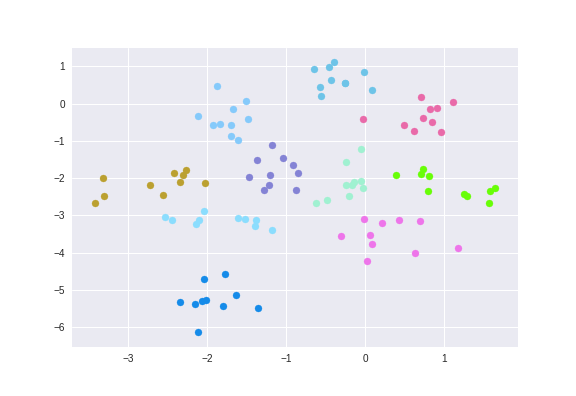

# Siamese-Networks

Implementation of simple Siamese Networks using Triplet Loss over MNIST dataset in Chainer framework. 

The following plot shows the clustering of the encoded information clustering for different classes of digits after training of the network

